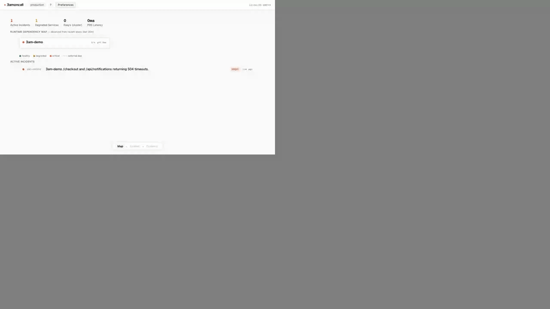

<p align="center">
  <a href="https://github.com/muras3/3am">
    <picture>
      <source media="(prefers-color-scheme: dark)" srcset="assets/logo-horizontal-dark.svg"/>
      
    </picture>
  </a>
</p>

<p align="center">サーバーレスのためのインシデント診断</p>

<p align="center">
  <a href="https://github.com/muras3/3am/actions/workflows/ci.yml"></a>
  <a href="https://www.npmjs.com/package/3am-cli"></a>
  <a href="#license"></a>
</p>

<p align="center">
  <a href="README.md">English</a> · <strong>日本語</strong>
</p>

---

OTel データを入れる → 診断とアクションプランが返ってくる。しきい値もランブックも不要。60 秒以内。

```
ROOT CAUSE HYPOTHESIS
  Checkout-orchestrator retries payment 429s at fixed 100ms intervals
  without backoff → saturates the 16-worker pool → 504s cascade to
  all routes behind it.

CAUSAL CHAIN
  1. Flash sale spike increases checkout demand
  2. Payment provider returns 429 (rate limited)
  3. App retries immediately — fixed interval, no backoff
  4. Worker pool saturates → queue depth hits 216
  5. All routes behind the pool start timing out
  6. 504s cascade to /checkout and /orders/:id

NEXT OPERATOR STEP
  ✓ Disable retries to the payment dependency
  ✓ Add exponential backoff or circuit breaker
  ✓ Shed non-critical checkout work to free workers

AVOID ASSUMING
  ✗ Database is the bottleneck — connections stable, no latency spike
  ✗ Recent deploy caused this — unrelated to concurrency config
  ✗ Scaling the DB will help — confirm bottleneck first
```
<p align="center">
  
</p>

---

## クイックスタート

```bash
npx 3am-cli init          # アプリに OTel 計装を組み込む
npx 3am-cli local         # ローカル Receiver を起動（Docker）
npx 3am-cli local demo    # デモインシデントを流して診断を確認
```

ブラウザで **http://localhost:3333** を開いてください。Docker と Node.js 20 以上が必要です。

> **AI コーディングエージェントからの導入を想定しています。**
> 3am は Claude Code や Codex のようなエージェントが、上記のセットアップを代わりに実行できるよう整えています。エージェント向けの機械可読セットアップガイドを [**llms-full.txt**](llms-full.txt) に置いてあるので、手元のエージェントに読ませてみてください。手動で上記のコマンドを実行する従来どおりの導入もそのまま使えます。

<details>
<summary>利用モード</summary>

| | `automatic` モード | `manual` モード |
|---|---|---|
| **こんなとき** | `ANTHROPIC_API_KEY`（または `OPENAI_API_KEY`）がある | Claude Code / Codex / Ollama のサブスクリプションを使っており、API キーは持っていない |
| **診断の流れ** | インシデント発生時に Receiver がサーバー側で LLM を呼ぶ | Console の「Run Diagnosis」ボタンを押すと、ブリッジ経由で手元の CLI に処理が渡る |
| **セットアップ** | `npx 3am-cli init --mode auto --provider anthropic` | `npx 3am-cli init --mode manual --provider claude-code` |
| **ブリッジ** | 不要 | 必要。別ターミナルで `npx 3am-cli bridge` を立ち上げる |

**API キーがあるなら → `auto` モードが本番向けの経路です:**

```bash
npx 3am-cli init --mode auto --provider anthropic
export ANTHROPIC_API_KEY=sk-ant-...
npx 3am-cli deploy vercel
```

**Claude Code / Codex サブスクリプションを使うなら → `manual` モード:**

```bash
npx 3am-cli init --mode manual --provider claude-code
npx 3am-cli local              # ターミナル 1
npx 3am-cli bridge             # ターミナル 2
```

> **よくあるミス:** `--mode manual --provider anthropic` は組み合わせとして矛盾しています。manual モードは、サーバー側の API キーを持っていないときに使うモードです。`ANTHROPIC_API_KEY` があるなら `--mode auto --provider anthropic` を指定してください。

</details>

<details>
<summary>各コマンド</summary>

**`3am init`** はランタイムを自動で検出し、OTel のセットアップまで行います:
- **Node.js / Vercel** — OTel 関連パッケージをインストールし、`instrumentation.ts` を生成、`.env` に OTLP エンドポイントを追記します
- **Cloudflare Workers** — `wrangler.toml` を書き換えて Workers Observability を有効化します

**`3am local demo`** はデモ用のインシデントを流し、実際の LLM 診断を走らせます（1 回あたり約 ¥10）。デモデータは `service.name=3am-demo` を使うので、本番のテレメトリと混ざりません。

**診断モード:**
- **automatic** — Receiver がサーバー側で診断を走らせる（API キーが必要）
- **manual** — 診断を Claude Code / Codex / Ollama 経由でローカルに回す（API キー不要）

**manual モードの注意:**
- `npx 3am-cli bridge` を起動したままにしておくと、Console からの再実行やチャットが手元のプロバイダまで届くようになります
- CLI から手動診断を直接叩くこともできます:

```bash
npx 3am-cli diagnose \
  --incident-id inc_000001 \
  --receiver-url http://localhost:3333 \
  --provider claude-code
```

**リモート manual モード（デプロイ済み Receiver にブリッジする）:**

Receiver は Vercel や Cloudflare にデプロイ済みだけれど、診断は手元の Claude Code / Codex サブスクリプションで回したい、というときは `--receiver-url` を使います:

```bash
npx 3am-cli bridge --receiver-url https://your-3am-receiver.vercel.app
```

ブリッジはデプロイ済みの Receiver に WebSocket で接続し（Cloudflare Workers では Durable Objects、Vercel では HTTP upgrade を経由）、診断リクエストをローカルで処理します。認証トークンは `npx 3am-cli deploy` が保存した認証情報から自動で読み取られます。

**manual モードのワークフロー（ローカル／デプロイ済み Receiver どちらでも）:**
- `npx 3am-cli init --mode manual --provider claude-code|codex|ollama` で初期化
- `npx 3am-cli bridge` でブリッジを起動（リモートなら `--receiver-url <url>` を付ける）
- Receiver を起動するときは、サーバー側のプロバイダ環境変数が manual モードを上書きしないようにする
  ブリッジ側のプロバイダ選択だけを効かせたい場合は、Receiver プロセスから `ANTHROPIC_API_KEY` / `OPENAI_API_KEY` を外しておいてください
- ローカル Receiver なら、`npx 3am-cli local` が `ALLOW_INSECURE_DEV_MODE=true` を自動で設定します
- dev 用 Receiver を別途立ち上げる場合、トークンなしで Console にアクセスしたいなら自分で `ALLOW_INSECURE_DEV_MODE=true` を設定してください

**Console の dev プロキシと認証について:**
- Console を dev で別起動する場合、Vite のプロキシはデフォルトで `http://localhost:3333` の Receiver を見に行きます
- Receiver が別ポートで動いているときだけ `VITE_RECEIVER_BASE_URL` で上書きしてください
- `npx 3am-cli local` は `ALLOW_INSECURE_DEV_MODE=true` を設定するので、Console の API リクエストにトークンは不要です
- `ALLOW_INSECURE_DEV_MODE=true` なしで Receiver を起動した場合、API ルートは `RECEIVER_AUTH_TOKEN` を要求し、Console もワンタイムのセキュアサインインリンクが必要になります

</details>

---

## デプロイ

| | コマンド | 提供されるもの |
|---|---|---|
| [](https://vercel.com/new/clone?repository-url=https://github.com/muras3/3am&env=ANTHROPIC_API_KEY&products=%5B%7B%22type%22%3A%22integration%22%2C%22group%22%3A%22postgres%22%7D%5D&project-name=3am) | `npx 3am-cli deploy vercel` | Neon Postgres の自動プロビジョニング、ワンタイムのセキュアサインインリンク |
| **Cloudflare** | `npx 3am-cli deploy cloudflare` | D1 をストレージに利用、Workers Observability との連携 |

<details>
<summary>Cloudflare デプロイに必要な API トークン権限</summary>

https://dash.cloudflare.com/profile/api-tokens で Cloudflare API トークンを作成し、以下の権限を**すべて**付与してから、`deploy cloudflare` の前に export してください:

- `Account Settings: Read`
- `Workers Scripts: Edit`
- `D1: Edit`
- `Cloudflare Queues: Edit`
- `Workers Observability: Edit`

```bash
export CLOUDFLARE_API_TOKEN=your-cloudflare-api-token
npx 3am-cli deploy cloudflare --yes
```

> `Workers Observability: Edit` は OTLP destinations API に必須ですが、Cloudflare 標準の「Edit Workers」テンプレートには含まれていません。カスタムトークンで作成してください。

</details>

デプロイが終わると、CLI が Console 用の有効期限つきワンタイムサインインリンクを出力します。あとから再発行したいときは `npx 3am-cli auth-link [receiver-url]` を実行してください。

---

## 仕組み

```
あなたのアプリ ──OTel──→ Receiver ──→ LLM ──→ Console
                  spans, logs,    anomaly     root cause,    incident board,
                  metrics         detection   action plan    evidence explorer
```

Receiver は OTLP/HTTP でテレメトリを取り込みます。異常を検知すると、何が壊れているかを構造化したスナップショット — **incident packet** を組み立て、そのまま LLM に渡します。しきい値を設定する必要も、ルールを書く必要もありません。

**LLM プロバイダの自動検出** — 使えるものを自動で選びます。設定は不要です:

| 優先度 | プロバイダ | 検出条件 |
|----------|----------|-----------|
| 1 | Anthropic | `ANTHROPIC_API_KEY` が環境変数にある |
| 2 | Claude Code | `claude` CLI が PATH にある |
| 3 | Codex | `codex` CLI が PATH にある |
| 4 | OpenAI | `OPENAI_API_KEY` が環境変数にある |
| 5 | Ollama | localhost:11434 で稼働中（無料・ローカル） |

---

## さらに詳しく

<details>
<summary><strong>設定</strong> — 保持期間・通知・ログ</summary>

### 保持期間

`RETENTION_HOURS` で、テレメトリとクローズ済みインシデントをどれだけ保持するかを決めます。デフォルトは `48` 時間。

オープン中のインシデントは、この設定に関係なく削除されません。

### 通知

```bash
npx 3am-cli integrations notifications
```

Slack や Discord（片方だけでも可）を、デプロイ済みの Receiver につなぎます。設定後は 3am が親インシデントの通知を投稿し、診断が完了すると同じ Slack スレッド／Discord スレッドに続報を投稿します。

セットアップ手順:
- [OSS 通知セットアップ](docs/integrations/notifications-oss-setup.ja.md)

Slack の最小スコープ:
- `chat:write`
- `channels:read`
- プライベートチャンネルも選べるようにするなら `groups:read`

Discord bot の最小権限:
- `View Channels`
- `Send Messages`
- `Create Public Threads`
- `Send Messages in Threads`
- `Read Message History`

### ログ

`@opentelemetry/auto-instrumentations-node` 経由でつながれた構造化ロガー（pino / winston / bunyan）が必要です。`console.log` はキャプチャ対象外です。

</details>

<details>
<summary><strong>セキュリティ</strong></summary>

- デプロイ前に [Anthropic の支出上限](https://console.anthropic.com/settings/billing) を設定してください。診断はインシデントごとに実行されるためです
- デプロイ時に有効期限つきワンタイムサインインリンクが表示されます。あとから `npx 3am-cli auth-link` で発行し直せます
- API キーはサーバー側のみで扱い、ブラウザには出しません

</details>

<details>
<summary><strong><code>3am init</code> が <code>next build</code> を <code>next build --webpack</code> に書き換える背景</strong></summary>

OpenTelemetry の自動計装（`@opentelemetry/auto-instrumentations-node`）は [require-in-the-middle](https://github.com/elastic/require-in-the-middle) を使い、Node.js のモジュールを `require()` のタイミングでフックします。この仕組みは、**バンドルに含めずに残したモジュール**を Node がランタイムで本物の `require` を使ってロードしたときにだけ動きます。Webpack と Next.js の `serverExternalPackages` の組み合わせは、こうしたモジュールをバンドルから外すやり方が十分に成熟しています。一方 Turbopack の externalization はまだこのケースに対応しきれておらず、Turbopack でビルドすると OTel 計装はエラーも出さないままテレメトリを止めてしまいます。

そこで `3am init` は `package.json` のビルドスクリプト中の `"next build"` を `"next build --webpack"` に書き換え、本番ビルドでは Webpack を強制的に使うようにします。dev サーバ（`next dev`）には影響しません。

Turbopack が OTel の要求する externalization の挙動を完全にサポートするか、OTel 側から require-in-the-middle の Turbopack ネイティブな代替が出るまで、このワークアラウンドは必要です。それまでは `--webpack` を外すと、ビルドは通っているように見えてもテレメトリは何も流れません。

</details>

<details>
<summary><strong>CLI リファレンス</strong></summary>

```bash
npx 3am-cli init                                    # アプリに OTel 計装を組み込む
npx 3am-cli init --mode auto --provider anthropic   # auto モード（API キー利用）
npx 3am-cli init --mode manual --provider claude-code  # manual モード（サブスクリプション利用）
npx 3am-cli local                                   # ローカル Receiver を起動
npx 3am-cli local demo                              # デモインシデントを実行
npx 3am-cli deploy vercel|cloudflare                # プラットフォームにデプロイ
npx 3am-cli integrations notifications              # Slack / Discord 通知を接続
npx 3am-cli auth-link [receiver-url]                # サインインリンクを再発行
npx 3am-cli diagnose --incident-id inc_000001       # 手動で診断を実行
npx 3am-cli bridge                                  # ローカル診断ブリッジを起動（ローカル Receiver 用）
npx 3am-cli bridge --receiver-url <url>             # WebSocket 経由でリモート Receiver につなぐ
```

`init` のフラグ: `--api-key`、`--mode auto|manual`、`--provider anthropic|openai|claude-code|codex|ollama`、`--model`、`--lang en|ja`、`--no-interactive`

`bridge` のフラグ: `--port`（デフォルト 4269）、`--receiver-url`（リモート WebSocket の接続先。省略時は認証情報から自動検出）

`deploy` のフラグ: `--yes`、`--no-interactive`、`--json`、`--project-name`、`--auth-token`

`integrations notifications` のフラグ: `--receiver-url`、`--auth-token`、`--provider slack|discord|both`、`--slack-bot-token`、`--slack-channel-id`、`--discord-bot-token`、`--discord-channel-id`、`--discord-webhook-url`

OSS 向けのおすすめフロー:

```bash
# Slack と Discord の bot トークンは、あらかじめ自分のワークスペース／サーバで取得しておく
npx 3am-cli integrations notifications \
  --provider both \
  --slack-bot-token xoxb-... \
  --slack-channel-id C... \
  --discord-bot-token ... \
  --discord-channel-id ...
```

</details>

---

## ライセンス

Apache-2.0 ライセンス — [LICENSE](LICENSE) を参照してください。
