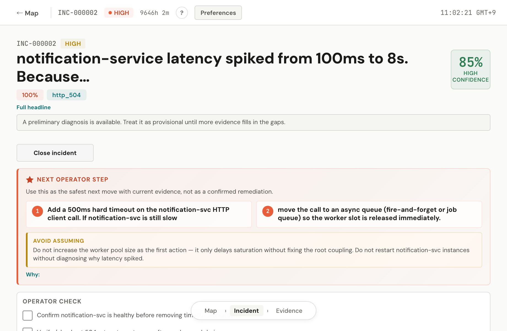

<p align="center">
  <a href="https://github.com/muras3/3am">
    <picture>
      <source media="(prefers-color-scheme: dark)" srcset="assets/logo-horizontal-dark.svg"/>
      
    </picture>
  </a>
</p>

<p align="center">Incident diagnosis for serverless apps</p>

<p align="center">
  <a href="https://github.com/muras3/3am/actions/workflows/ci.yml"></a>
  <a href="https://www.npmjs.com/package/3am-cli"></a>
  <a href="#license"></a>
</p>

---

OTel data in → diagnosis + action plan out. No thresholds. No runbooks. Under 60 seconds.

```
ROOT CAUSE HYPOTHESIS
  Checkout-orchestrator retries payment 429s at fixed 100ms intervals
  without backoff → saturates the 16-worker pool → 504s cascade to
  all routes behind it.

CAUSAL CHAIN
  1. Flash sale spike increases checkout demand
  2. Payment provider returns 429 (rate limited)
  3. App retries immediately — fixed interval, no backoff
  4. Worker pool saturates → queue depth hits 216
  5. All routes behind the pool start timing out
  6. 504s cascade to /checkout and /orders/:id

NEXT OPERATOR STEP
  ✓ Disable retries to the payment dependency
  ✓ Add exponential backoff or circuit breaker
  ✓ Shed non-critical checkout work to free workers

AVOID ASSUMING
  ✗ Database is the bottleneck — connections stable, no latency spike
  ✗ Recent deploy caused this — unrelated to concurrency config
  ✗ Scaling the DB will help — confirm bottleneck first
```
<p align="center">
  
</p>

---

## Quick Start

```bash
npx 3am-cli init          # instrument your app with OTel
npx 3am-cli local         # start local receiver (Docker)
npx 3am-cli local demo    # inject a demo incident → see diagnosis
```

Open **http://localhost:3333**. Requires Docker and Node.js 20+.

<details>
<summary>Which mode should I pick?</summary>

| | `automatic` mode | `manual` mode |
|---|---|---|
| **When to use** | You have an `ANTHROPIC_API_KEY` (or `OPENAI_API_KEY`) | You use Claude Code, Codex, or Ollama subscription — no API key |
| **How diagnosis runs** | Receiver calls the LLM server-side on every incident | You click "Run Diagnosis" in the Console; the bridge routes it through your local CLI |
| **Setup** | `npx 3am-cli init --mode auto --provider anthropic` | `npx 3am-cli init --mode manual --provider claude-code` |
| **Bridge required** | No | Yes — run `npx 3am-cli bridge` in a terminal |

**Using an API key? → `auto` mode is the production path:**

```bash
npx 3am-cli init --mode auto --provider anthropic
export ANTHROPIC_API_KEY=sk-ant-...
npx 3am-cli deploy vercel
```

**Using Claude Code / Codex subscription? → `manual` mode:**

```bash
npx 3am-cli init --mode manual --provider claude-code
npx 3am-cli local              # terminal 1
npx 3am-cli bridge             # terminal 2
```

> **Common mistake:** `--mode manual --provider anthropic` is a contradiction — manual mode is for when you don't have a server-side API key. If you have `ANTHROPIC_API_KEY`, use `--mode auto --provider anthropic`.

</details>

<details>
<summary>What each command does</summary>

**`3am init`** detects your runtime and sets up OTel automatically:
- **Node.js / Vercel** — installs OTel deps, creates `instrumentation.ts`, writes OTLP endpoint to `.env`
- **Cloudflare Workers** — updates `wrangler.toml` to enable Workers Observability

**`3am local demo`** injects a synthetic incident and runs a real LLM diagnosis (~¥10/run). Demo data uses `service.name=3am-demo` — won't mix with your telemetry.

**Diagnosis modes:**
- **automatic** — receiver runs diagnosis server-side (needs API key)
- **manual** — route diagnosis through Claude Code, Codex, or Ollama locally (no API key needed)

**Manual mode notes:**
- start `npx 3am-cli bridge` when using manual mode so Console reruns and chat can reach your local provider
- you can also run manual diagnosis directly:

```bash
npx 3am-cli diagnose \
  --incident-id inc_000001 \
  --receiver-url http://localhost:3333 \
  --provider claude-code
```

**Remote manual mode (bridge to a deployed Receiver):**

If your Receiver is deployed (Vercel, Cloudflare) but you want to run diagnosis locally through your Claude Code or Codex subscription, use the `--receiver-url` flag:

```bash
npx 3am-cli bridge --receiver-url https://your-3am-receiver.vercel.app
```

The bridge connects to the deployed Receiver via WebSocket (Durable Objects on CF Workers, HTTP upgrade on Vercel) and handles diagnosis requests locally. Auth token is auto-detected from credentials saved by `npx 3am-cli deploy`.

**Manual mode workflow (local or hosted Receiver):**
- `npx 3am-cli init --mode manual --provider claude-code|codex|ollama`
- start the bridge: `npx 3am-cli bridge` (add `--receiver-url <url>` for a remote Receiver)
- start the Receiver without a server-side provider env var taking precedence over manual mode
  remove `ANTHROPIC_API_KEY` / `OPENAI_API_KEY` from the Receiver process if you want provider selection to come only from the bridge side
- for local Receiver, `npx 3am-cli local` already sets `ALLOW_INSECURE_DEV_MODE=true`
- for a separately started dev Receiver, set `ALLOW_INSECURE_DEV_MODE=true` yourself if you want token-free Console access

**Console dev proxy and auth:**
- if you run the Console separately in dev, its Vite proxy expects the Receiver at `http://localhost:3333` by default
- override with `VITE_RECEIVER_BASE_URL` only when your Receiver is on a different port
- `npx 3am-cli local` sets `ALLOW_INSECURE_DEV_MODE=true`, so Console API requests do not require a token
- if you run the Receiver without `ALLOW_INSECURE_DEV_MODE=true`, API routes require `RECEIVER_AUTH_TOKEN` and the Console expects a secure one-time sign-in link

</details>

---

## Deploy

| | Command | What you get |
|---|---|---|
| [](https://vercel.com/new/clone?repository-url=https://github.com/muras3/3am&env=ANTHROPIC_API_KEY&products=%5B%7B%22type%22%3A%22integration%22%2C%22group%22%3A%22postgres%22%7D%5D&project-name=3am) | `npx 3am-cli deploy vercel` | Neon Postgres auto-provisioned, `AUTH_TOKEN` on first access |
| **Cloudflare** | `npx 3am-cli deploy cloudflare` | D1 storage, Workers Observability integration |

<details>
<summary>Cloudflare deploy — required API token permissions</summary>

Create a Cloudflare API token at https://dash.cloudflare.com/profile/api-tokens with **all** of the following permissions, then export it before running `deploy cloudflare`:

- `Account Settings: Read`
- `Workers Scripts: Edit`
- `D1: Edit`
- `Cloudflare Queues: Edit`
- `Workers Observability: Edit`

```bash
export CLOUDFLARE_API_TOKEN=your-cloudflare-api-token
npx 3am-cli deploy cloudflare --yes
```

> `Workers Observability: Edit` is required for the OTLP destinations API and is **not** included in Cloudflare's pre-built "Edit Workers" template — you must use a custom token.

</details>

After deploy, the CLI prints a short-lived one-time sign-in link for the Console. Mint another later with `npx 3am-cli auth-link [receiver-url]`.

---

## How It Works

```
Your App ──OTel──→ Receiver ──→ LLM ──→ Console
              spans, logs,    anomaly     root cause,    incident board,
              metrics         detection   action plan    evidence explorer
```

The receiver ingests OTLP/HTTP telemetry. When anomalies cross thresholds, it forms an **incident packet** — a structured snapshot of what's wrong — and feeds it to an LLM. No thresholds to configure. No rules to write.

**LLM provider auto-detection** — uses whatever's available, no config needed:

| Priority | Provider | Detection |
|----------|----------|-----------|
| 1 | Anthropic | `ANTHROPIC_API_KEY` in env |
| 2 | Claude Code | `claude` CLI in PATH |
| 3 | Codex | `codex` CLI in PATH |
| 4 | OpenAI | `OPENAI_API_KEY` in env |
| 5 | Ollama | Running on localhost:11434 (free, local) |

---

## More

<details>
<summary><strong>Configuration</strong> — retention, notifications, logging</summary>

### Retention

`RETENTION_HOURS` controls how long telemetry and closed incidents are kept. Default: `48` hours.

Open incidents are never deleted regardless of retention setting.

### Notifications

```bash
export NOTIFICATION_WEBHOOK_URL="https://hooks.slack.com/services/..."
```

Posts to Slack or Discord when an incident is detected. Fire-and-forget — never blocks incident processing.

### Logs

Requires a structured logger (pino, winston, bunyan) wired through `@opentelemetry/auto-instrumentations-node`. `console.log` is not captured.

</details>

<details>
<summary><strong>Security</strong></summary>

- Set an [Anthropic spending limit](https://console.anthropic.com/settings/billing) before deploying — diagnosis runs on every incident
- Deploy prints a short-lived one-time sign-in link. Mint a fresh one later with `npx 3am auth-link`
- API keys are server-side only, never exposed to the browser

</details>

<details>
<summary><strong>CLI reference</strong></summary>

```bash
npx 3am-cli init                                    # set up OTel in your app
npx 3am-cli init --mode auto --provider anthropic   # auto mode (API key path)
npx 3am-cli init --mode manual --provider claude-code  # manual mode (subscription path)
npx 3am-cli local                                   # start local receiver
npx 3am-cli local demo                              # run demo incident
npx 3am-cli deploy vercel|cloudflare                # deploy to platform
npx 3am-cli auth-link [receiver-url]                # mint a fresh sign-in link
npx 3am-cli diagnose --incident-id inc_000001       # manual diagnosis
npx 3am-cli bridge                                  # start local diagnosis bridge (local receiver)
npx 3am-cli bridge --receiver-url <url>             # connect bridge to a remote deployed receiver via WebSocket
```

`init` flags: `--api-key`, `--mode auto|manual`, `--provider anthropic|openai|claude-code|codex|ollama`, `--model`, `--lang en|ja`, `--no-interactive`

`bridge` flags: `--port` (default 4269), `--receiver-url` (remote WebSocket target; auto-detected from credentials if omitted)

`deploy` flags: `--yes`, `--no-interactive`, `--json`, `--project-name`, `--auth-token`

</details>

<sub><a href="llms-full.txt">AI agents: read llms-full.txt for machine-readable setup instructions</a></sub>

---

## License

Apache-2.0 — see [LICENSE](LICENSE).
