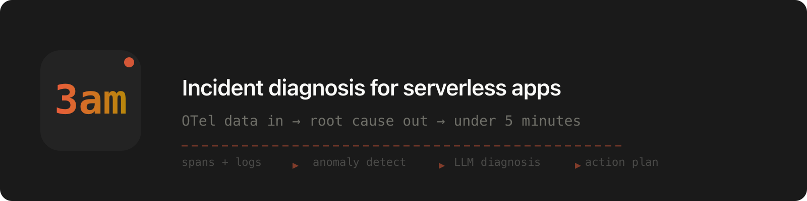

<p align="center">
  <a href="https://github.com/muras3/3am">
    
  </a>
</p>

<p align="center">
  <strong>Diagnose serverless app incidents in under 5 minutes using OTel data + LLM.</strong>
</p>

<p align="center">
  <a href="https://github.com/muras3/3am/actions/workflows/ci.yml"></a>
  <a href="https://www.npmjs.com/package/3amoncall"></a>
  <a href="#license"></a>
</p>

<p align="center">
  <a href="#quick-start">Quick Start</a> ·
  <a href="#features">Features</a> ·
  <a href="#deploy">Deploy</a> ·
  <a href="#how-it-works">How It Works</a> ·
  <a href="CONTRIBUTING.md">Contributing</a>
</p>

---

## Features

- **Automatic incident detection** — anomaly detection on OTel spans, logs, and metrics; no manual threshold config
- **LLM-powered root cause analysis** — forms an incident packet and feeds it to an LLM for structured diagnosis
- **Pluggable LLM providers** — Anthropic, OpenAI, Ollama, Claude Code, Codex; auto-detects what's available
- **Real-time console** — incident board, causal chain, evidence explorer, AI copilot
- **Slack & Discord notifications** — webhook-based alerts when incidents are detected
- **One-command deploy** — `npx 3am deploy vercel` or `npx 3am deploy cloudflare`

---

## Quick Start

**Prerequisites:** Docker Desktop, Node.js 18+

```bash
npx 3am init          # set up OTel SDK in your app
npx 3am local         # start local Receiver (Docker)
npx 3am local demo    # inject a demo incident & see diagnosis
```

Then open **http://localhost:3333** to view the console.

<details>
<summary><strong>More details</strong></summary>

`3am local demo` injects a synthetic downstream-timeout scenario and runs a real LLM diagnosis (~¥10/run). Demo data uses `service.name=3am-demo` and won't mix with your app's telemetry.

`3am init` is runtime-aware. For Node.js and Vercel it installs OTel dependencies, creates `instrumentation.ts/js`, and writes `OTEL_EXPORTER_OTLP_ENDPOINT=http://localhost:3333` to `.env`. For Cloudflare Workers it updates `wrangler.toml` or `wrangler.jsonc` to enable Workers Observability.

`3am init` captures a diagnosis mode and provider choice:

- **automatic** — Receiver runs diagnosis server-side
- **manual** — Console and CLI route diagnosis through a local bridge (`npx 3am bridge`), so you can use Claude Code, Codex, Ollama, or another provider without an API key

You can also run manual diagnosis directly from the CLI:

```bash
npx 3am diagnose \
  --incident-id inc_000001 \
  --receiver-url http://localhost:3333 \
  --provider claude-code
```

For your own app telemetry, start your app with instrumentation loaded:

```bash
node --require ./instrumentation.js your-app.js
```

**LLM provider auto-detection** (when no `--provider` flag is given):

1. `ANTHROPIC_API_KEY` in env → Anthropic
2. `claude` CLI in PATH → Claude Code (uses subscription)
3. `codex` CLI in PATH → Codex (uses subscription)
4. `OPENAI_API_KEY` in env → OpenAI
5. Ollama running on localhost:11434 → Ollama (free, local)

</details>

---

## Deploy

### Vercel

[](https://vercel.com/new/clone?repository-url=https://github.com/muras3/3am&env=ANTHROPIC_API_KEY&envDescription=Anthropic%20API%20key%20for%20LLM%20diagnosis&envLink=https://console.anthropic.com/settings/keys&products=%5B%7B%22type%22%3A%22integration%22%2C%22group%22%3A%22postgres%22%7D%5D&project-name=3am&repository-name=3am)

```bash
npx 3am deploy vercel
```

Neon Postgres is auto-provisioned. After deploy, open Console — the first-access screen displays your `AUTH_TOKEN`.

<details>
<summary><strong>Vercel deploy details</strong></summary>

1. Click the button above or run `npx 3am deploy vercel`
2. Choose `automatic` or `manual` diagnosis mode
3. If automatic, set `ANTHROPIC_API_KEY` or another server-side provider credential
4. Set `RETENTION_HOURS` if you need a window other than 48 hours
5. Point your app at the production Receiver

For CI / non-interactive:

```bash
npx 3am deploy vercel --yes --no-interactive --json
```

</details>

### Cloudflare Workers

```bash
export CLOUDFLARE_API_TOKEN=your-cloudflare-api-token
npx 3am deploy cloudflare --yes
```

<details>
<summary><strong>Cloudflare deploy details</strong></summary>

The CLI needs a Cloudflare API Token with these account-level permissions:

- `Workers Scripts:Edit`
- `Logs:Edit`

What `deploy cloudflare` does:

1. Deploys the 3am receiver to Cloudflare
2. Creates or updates OTLP destinations for traces and logs
3. Updates the current directory's `wrangler.toml` or `wrangler.jsonc`
4. Deploys the current Cloudflare Worker so telemetry starts flowing

If `CLOUDFLARE_API_TOKEN` is missing, the CLI falls back to prompting for a Global API Key in interactive mode only.

</details>

---

## How It Works

```
Your App (OTel SDK)
  → Receiver (OTLP ingest, anomaly detection, incident packet formation)
  → LLM diagnosis
    → automatic mode: inline in Receiver
    → manual mode: local bridge / CLI, then persisted back to Receiver
  → Console (incident board, evidence explorer, AI copilot)
```

The Receiver collects spans, metrics, and logs via OTLP/HTTP. When anomaly thresholds are crossed, it forms an incident packet. In `automatic` mode, it resolves a server-side provider and runs diagnosis inline. In `manual` mode, Console and CLI actions trigger local execution through the bridge and post the results back.

---

## Configuration

### Retention

Set `RETENTION_HOURS` to control how long telemetry data and closed incidents are kept. Default: `1` hour. Cleanup is lazy, triggered by incoming requests at most once every 5 minutes.

| `RETENTION_HOURS` | Retention |
|-------------------|-----------|
| `1` (default)     | 1 hour    |
| `24`              | 24 hours  |
| `72`              | 72 hours  |

Open incidents are never deleted by cleanup regardless of retention.

### Notifications

3am posts to Slack or Discord when an incident is detected.

```bash
export NOTIFICATION_WEBHOOK_URL="https://hooks.slack.com/services/..."
# or
npx 3am init   # configure interactively
```

<details>
<summary><strong>Webhook setup</strong></summary>

**Slack:** https://api.slack.com/apps → Create New App → From Scratch → Incoming Webhooks → toggle ON → Add New Webhook → copy URL.

**Discord:** Server Settings → Integrations → Webhooks → New Webhook → copy URL.

Notifications include incident ID, severity, affected service, trigger signals, and a console link. Fire-and-forget — never blocks incident processing.

</details>

### Logs

Logs require a structured logger (pino, winston, or bunyan) wired through `@opentelemetry/auto-instrumentations-node`. `console.log` is not captured.

---

## Self-Instrumentation

3am can emit OpenTelemetry about the receiver itself.

| Platform | Traces | Logs | How |
|----------|--------|------|-----|
| Vercel / Node.js | Yes | Yes | Node OTel SDK exports receiver HTTP activity |
| Cloudflare Workers | Yes (experimental) | Yes | Workers Observability automatic tracing |

<details>
<summary><strong>Setup details</strong></summary>

### Vercel / Node.js

```bash
SELF_OTEL_ENABLED=true
SELF_OTEL_EXPORTER_OTLP_ENDPOINT=https://your-otel-backend.example.com
SELF_OTEL_SERVICE_NAME=3am-receiver
SELF_OTEL_SERVICE_NAMESPACE=3am
SELF_OTEL_DEPLOYMENT_ENVIRONMENT=production
```

Optional:

```bash
SELF_OTEL_EXPORTER_OTLP_HEADERS=Authorization=Bearer your-token,x-tenant=dogfood
SELF_OTEL_CONSOLE_LOGS=true
```

### Cloudflare Workers

Experimental. Workers Observability is enabled in `wrangler.toml`. Traces and logs are supported; metrics and custom spans are not.

### User Telemetry vs Self Telemetry

Use separate destinations so dogfooding data does not pollute your application's incident stream.

</details>

---

## Security

- **Anthropic spending limit:** Set a monthly spend cap at [console.anthropic.com](https://console.anthropic.com/settings/billing) before deploying. Diagnosis runs on every incident.
- **AUTH_TOKEN:** Stored in `localStorage` after first access. To recover, check `RECEIVER_AUTH_TOKEN` in your deployment environment variables.
- **API keys:** Stored as deployment environment variables (server-side only, never exposed to the browser).

---

## License

Apache-2.0 — see [LICENSE](LICENSE) for details.
