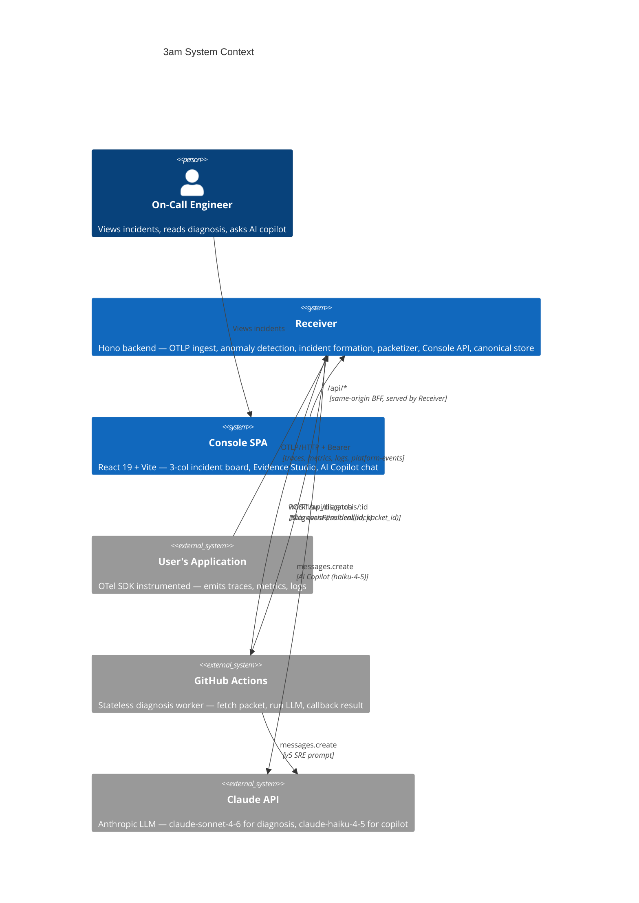

# System Overview — 3am

> High-level system context: who talks to what, and where the boundaries are.

<!-- Comment:
  Receiver が中心。診断用の LLM API キーは GitHub Actions 側にのみ存在し、
  Receiver は持たない (ADR 0015)。ただし AI Copilot (haiku) は
  Receiver が直接呼ぶ (ADR 0027)。
  Console は Receiver から同一オリジンで serve される (ADR 0028) ため、
  Bearer token はブラウザバンドルに含まれない。
-->
