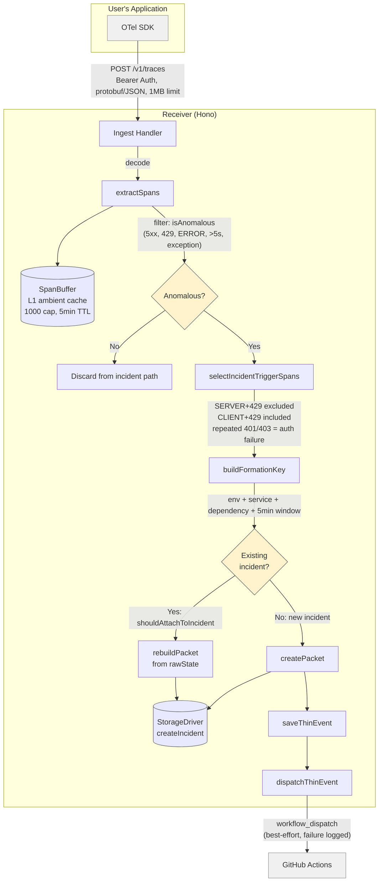

# Data Flow — OTLP Trace Ingest

> Primary data path: from OTel SDK to incident creation or attachment.

<!-- Comment:
  isAnomalous と isIncidentTrigger は別概念。
  isAnomalous = "何かおかしい span" (全部 SpanBuffer + rawState に入る)
  isIncidentTrigger = "新しい incident を開くべき span"
    → SERVER+429 は自分がrate-limitしてるだけなので trigger にならない
    → CLIENT+429 は外部依存が返してきた → trigger になる
  この区別が ADR 0008 の「LLM なしのグルーピング」の肝。
-->
