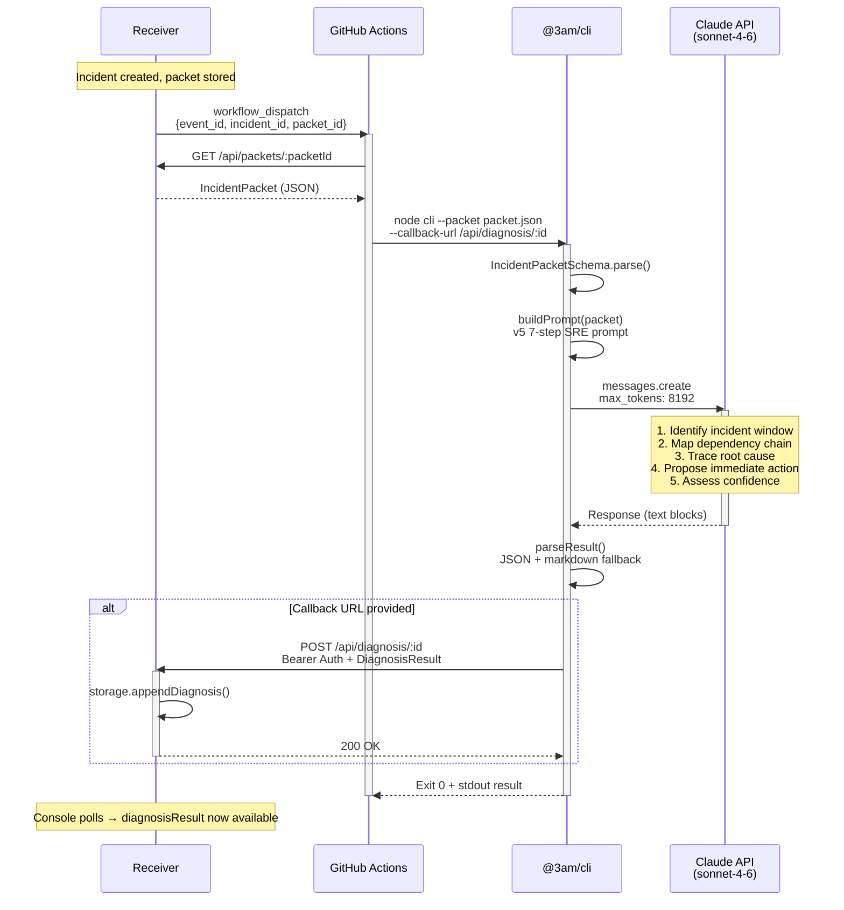

# Diagnosis Flow — Sequence Diagram

> Request lifecycle: thin event dispatch → LLM diagnosis → result callback.

<!-- Comment:
  GitHub Actions は完全に stateless。canonical data は全て Receiver に住む。
  CLI は GitHub Actions 以外からも実行可能（ローカル開発、検証パイプライン）。
  retry: 429/502/503/529 に対して最大2回リトライ、exponential backoff。
  parse 失敗や 4xx client error にはリトライしない (ADR 0019 v2)。
-->
