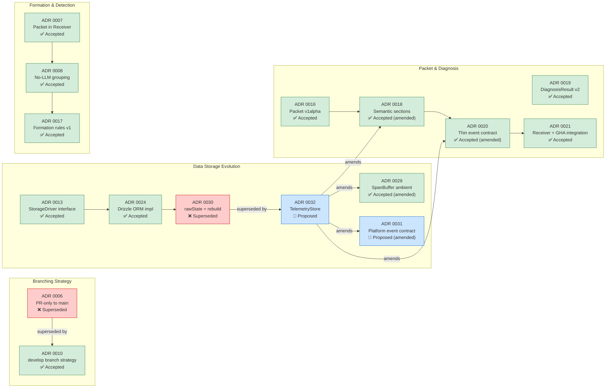

# ADR Supersession & Amendment Map

> How architectural decisions relate to each other.

<!-- Comment:
  ADR 0032 が最も影響範囲が広い:
    - ADR 0030 を完全に置き換え (rawState 廃止)
    - ADR 0029 を修正 (SpanBuffer = L1 cache に降格)
    - ADR 0031 を修正 (platform events → TelemetryStore に移動)
    - ADR 0018 を修正 (packet rebuild source: rawState → TelemetryStore snapshot)
    - ADR 0020 を修正 (packet_id → latest canonical view)

  現在 "Proposed" なのは ADR 0031 と 0032。
  これらの実装が Phase 1 の残りの大きな作業。
-->
